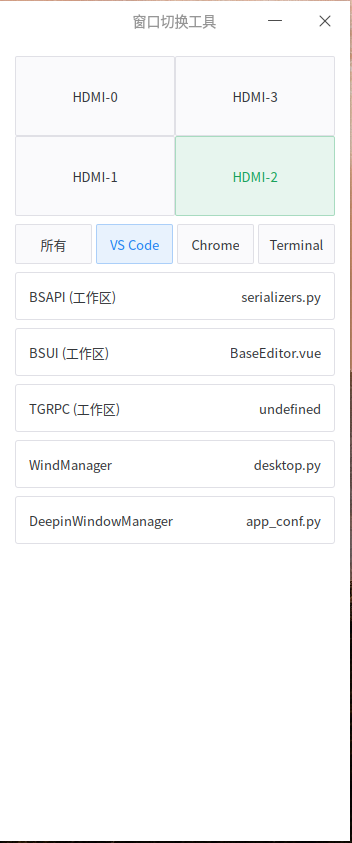

快速在多个屏幕上移动窗口。



# 环境

## Python

```bash
conda create -n windman python=3.12
conda activate windman
```

## 框架依赖

```bash
$ pip install fastapi uvicorn pywebview requests
```

使用 GTK 时需要安装：

```bash
# ModuleNotFoundError: No module named 'gi'
$ pip install pygobject
```

使用 Qt 时需要安装：

```bash
# ModuleNotFoundError: No module named 'qtpy'
$ pip install pyqt
```

## 打包依赖

```bash
$ pip install nuitka
$ conda install libpython-static -y
```

## 应用依赖

```bash
$ pip install screeninfo wmctrl
```

## 其它问题

运行程序 `python backend/desktop.py` 可能会遇到下面这些错误。

### GLIBCXX_3.4.30

报错信息如下：

```
** (desktop.py:2060388): WARNING **: 12:05:38.141: Failed to load shared library 'libwebkit2gtk-4.1.so.0' referenced by the typelib: ~/.opt/miniconda3/envs/windman/bin/../lib/libstdc++.so.6: version `GLIBCXX_3.4.30' not found (required by /lib/x86_64-linux-gnu/libwebkit2gtk-4.1.so.0)

** (desktop.py:2060388): WARNING **: 12:05:38.141: Failed to load shared library 'libjavascriptcoregtk-4.1.so.0' referenced by the typelib: ~/.opt/miniconda3/envs/windman/bin/../lib/libstdc++.so.6: version `GLIBCXX_3.4.30' not found (required by /lib/x86_64-linux-gnu/libjavascriptcoregtk-4.1.so.0)

Traceback (most recent call last):
  ...

gi.repository.GLib.GError: g-invoke-error-quark: Could not locate webkit_get_major_version: ~/.opt/miniconda3/envs/windman/bin/../lib/libstdc++.so.6: version `GLIBCXX_3.4.30' not found (required by /lib/x86_64-linux-gnu/libjavascriptcoregtk-4.1.so.0) (1)
```

大意就是 `~/.opt/miniconda3/envs/windman/bin/../lib/libstdc++.so.6` 这个文件中没有检测到 GLIBCXX_3.4.30，验证一下：

```bash
$ strings ~/.opt/miniconda3/envs/windman/bin/../lib/libstdc++.so.6 | grep GLIBCXX_3.4.30
```

打印结果为空，说明确实没有。再验证一下系统自带的：

```bash
$ strings /usr/lib/x86_64-linux-gnu/libstdc++.so.6 | grep GLIBCXX_3.4.30
GLIBCXX_3.4.30
```

系统自带的有，改一下链接：

```bash
$ cd ~/.opt/miniconda3/envs/windman/bin/../lib
$ ls -lh libstdc++.so.6
lrwxrwxrwx 1 barwe barwe 19 11月25日 12:00 libstdc++.so.6 -> libstdc++.so.6.0.29
$ rm libstdc++.so.6
$ ln -s /usr/lib/x86_64-linux-gnu/libstdc++.so.6 .
```

再次确认：

```bash
$ strings ~/.opt/miniconda3/envs/windman/bin/../lib/libstdc++.so.6 | grep GLIBCXX_3.4.30
GLIBCXX_3.4.30
```

### GCC_12.0.0

报错信息如下：

```
** (desktop.py:2062538): WARNING **: 12:14:15.253: Failed to load shared library 'libwebkit2gtk-4.1.so.0' referenced by the typelib: ~/.opt/miniconda3/envs/windman/bin/../lib/libgcc_s.so.1: version `GCC_12.0.0' not found (required by /lib/x86_64-linux-gnu/libhwy.so.1)

Traceback (most recent call last):
  ...

gi.repository.GLib.GError: g-invoke-error-quark: Could not locate webkit_get_major_version: 'webkit_get_major_version': /lib/x86_64-linux-gnu/libjavascriptcoregtk-4.1.so.0: undefined symbol: webkit_get_major_version (1)
```

大意就是 `~/.opt/miniconda3/envs/windman/bin/../lib/libgcc_s.so.1` 这个文件中没有检测到 GCC_12.0.0，验证一下：

```bash
$ strings ~/.opt/miniconda3/envs/windman/bin/../lib/libgcc_s.so.1 | grep GCC_12.0.0
```

再看一下系统自带的：

```bash
$ strings /usr/lib/x86_64-linux-gnu/libgcc_s.so.1 | grep CC_12.0.0
GCC_12.0.0
```

这里应该可以用系统自带的替换 conda 里面的，有待验证。

另一个解决办法是，conda 可以直接安装 GCC_12.0.0，这个办法兼容性更好。

```bash
$ conda search -c conda-forge gcc | grep 12.
...
gcc                           11.4.0     h602e360_12  conda-forge
gcc                           12.1.0     h9ea6d83_10  conda-forge
gcc                           12.2.0     h26027b1_11  conda-forge
...
```

这里 conda 没有提供 GCC_12.0.0 但是提供了 GCC_12.1.0，安装这个效果一样。

```bash
$ conda install -c conda-forge gcc=12.1.0 -y
```

### G_VALUE_HOLDS_BOXED

报错信息如下：

```
~/.opt/miniconda3/envs/windman/lib/python3.12/site-packages/gi/overrides/Gdk.py:444: Warning: g_value_set_boxed: assertion 'G_VALUE_HOLDS_BOXED (value)' failed
  initialized, argv = Gdk.init_check(sys.argv)
Could not determine the accessibility bus address

(WebKitWebProcess:2065434): GLib-GObject-CRITICAL **: 12:22:19.455: g_value_set_boxed: assertion 'G_VALUE_HOLDS_BOXED (value)' failed
```

未解决，但是好像没啥影响。

## 开发和打包

运行独立的桌面程序，以测试打包环境是否存在问题：

```bash
python backend/desktop.py
```

前端打包：

```bash
cd frontend && pnpm install && pnpm build
```

桌面端打包：

```bash
nuitka --standalone --onefile \
--output-dir=dist \
--output-filename=windman \
--remove-output \
--windows-icon-from-ico=gui/favicon.ico \
--include-data-dir=gui=gui \
backend/desktop.py
```
